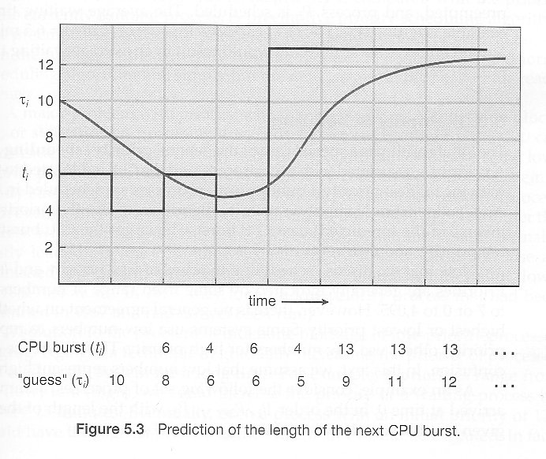

##### Concepts
- CPU scheduling deals with deciding which process in the ready queue
is to be allocated the CPU
- CPU burst: a state of process in which it is performing calculation using CPU
- I/O burst: a state of process in which it is waiting for I/O - data transfer in out the system
##### Algorithms
1. FCFS
- first come first serve
- long waiting time
2. Shortest job first
- minimum waiting time
- how to predict CPU burst time:
```
    estimate[i+1] = alpha * burst[i] + (1-alpha) * estimate[i]
    alpha = 0.5
```


3. Priority scheduling
- Priorities can be assigned either internally or externally. Internal priorities are assigned by the OS using criteria such as average burst time, ratio of CPU to I/O activity, system resource use, and other factors available to the kernel. External priorities are assigned by users, 
based on the importance of the job, fees paid, politics, etc.
- Disadvantage: starvation, some low-priority task can wait forever

4. Round robin
- Similar to FCFS, but each CPU burst is assigned with limit called time quantum
- When a process is given the CPU, a timer is set for whatever value has been set for a time quantum.
    - If the process finishes its burst before the time quantum timer expires, then it is swapped out of the CPU just like the normal FCFS algorithm.
    - If the timer goes off first, then the process is swapped out of the CPU and moved to the back end of the ready queue.
- all processes share CPU equally
