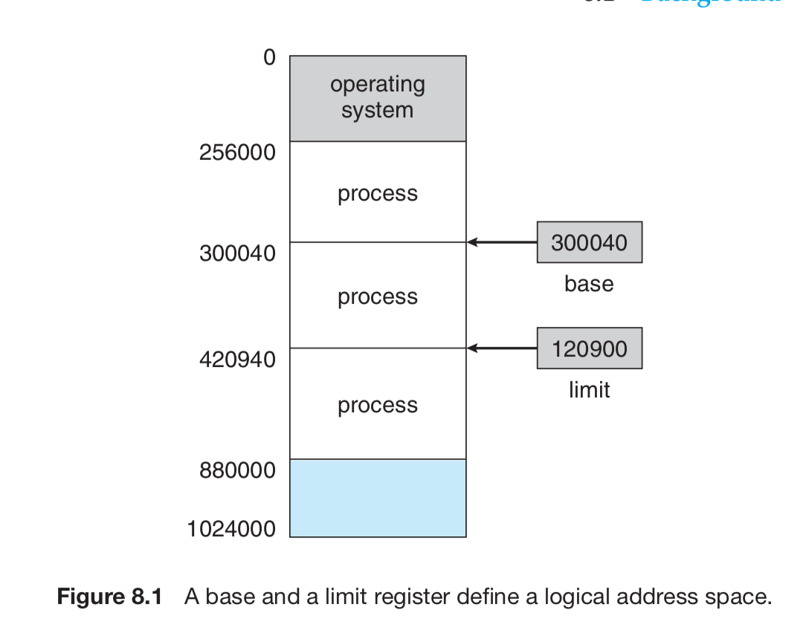

1. Register
- data holding place that are built into the processor itself
- hold data (instruction) that are currently processed by CPU
- small capacity: 32bit, 64 bit

2. Memory
- Hardware device that holds instruction, data that executing program
in CPU requires 
- GB -> TB

- Segment: memory assigned to a process

3. Swapping
- a mechanism in which a process can be swapped temporarily out of
main memory to disk and make that memory available for other process.

4. Why do we need separate logical memory and physical memory?
- Dealing with physical memory is inconvenience to both OS and programmer
- We map the logical memory (programmer's memory view) and
physical memory (OS's memory view) => system has freedom to manage and
optimize the memory, programmer has a more natural programming environment.
