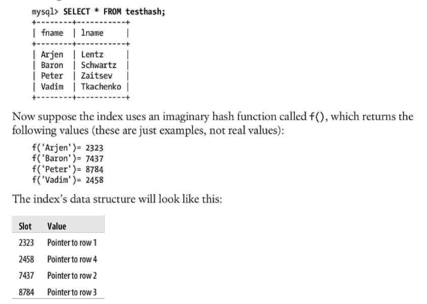

1. Index: data structure that storage engine use to find rows quickly.
- Storage engine look up the matching value in Index data structure => Index contain
the pointer to the row contains the match.

2. Btree
- each node contains multiple indexes
- indexes in each node are sorted in increasing order
- each node is corresponding to 1 logical block in disk: 512 bytes.
Disk reader read the data one block at a time.
- index pointers are stored in both internal nodes and leaf nodes
- a full scan require a full tree traversal

2. B+tree
- index pointers are stored in leaf node
- leaf node are linked => full scan requires just one linear pass though all
leaf nodes
- internal node only contain index key => more index keys can be stored 
in 1 node => can decrease the height of the tree


3. Btree index usage: index (last_name, first_name, dob)
- can use:
    - match full value: find user name Hoang Quang who was born 1995-03-03
    - left most prefix: find all user whose last name is Hoang
    - first column prefix: find all user whose last name start with `H`
    - range value
- cannot use:
    - look up that doesn't start from leftmost column in index
    - cannot skip column in index: user whose last name is Hoang, and was
    born on a particular date
    - any column to the right of the first range column:
    WHERE last_name = "Hoang" AND first_name LIKE 'Q%' AND dob = '1995-03-03'
    => only use 2 first columns index

4. Hash indexes  
- same as a hashtable: key is the hash value of the index column(s), value is the pointer  
    
    

- lookup are lightning fast
- limit:
    - only equality comparision: = != IN()
    - cannot use for sorting
    - doesn't support partial key matching


5. Cost of indexes
- more storage space to store indexes
- indexes need to be updated in update, create, delete query

6. Guideline on Indexes:
- isolate the index column: the index column should be alone on 1 side
of the comparison operator
- to index long character col: use prefix index
- Do not use index for high-write & low-read table
- Do not use index for small table
- Place most selective column first in the index. 
```
    selectivity of column x = count(distinct(x)) / count(*)
```
- Keep the range criterion at the end of the index (e.g. age)
- Consider adding special index for low selectivity cases (number of row are large)
- [Use auto incremental PK in the table what need pagination](https://medium.com/swlh/why-you-shouldnt-use-offset-and-limit-for-your-pagination-4440e421ba87)

7. Clustered index
- an approach of data storage
- data is stored in order of the index
- only one clustered index per table
- leaf node of BTree is the actual data
- advantages:
    - keep related data closed together
    - data access is fast
- disadvantages:
    - update clustered index column is expensive as it requires moving 
    actual data to a new location
    - 
