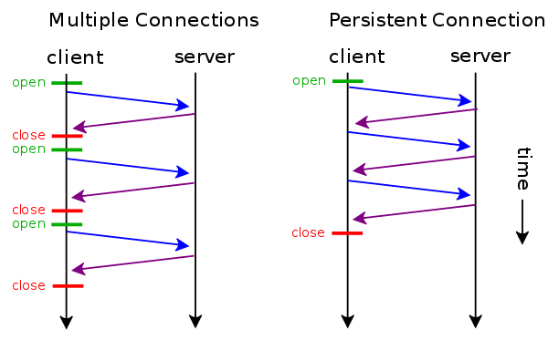

#### What is HTTP?
- hyper text transfer protocol
- the protocol that web server and web client use to communicate with each other over Internet
#### Basic properties:
    - stateless:
        - after the request from client is serviced by client, the connection is disconnected
        - each request is independently
        - why: maintaining a connection is resource intensive
    - connectionless:
        - before sending request, client must establish connection with server
        - after request was served, connection is destroyed
        - reason: server resource should be shared equally by all clients.    

#### HTTP persistent/ HTTP keep-alive

- using a TCP connection to send and receive multiple http request/response
- Advantage:
    - reduce latency of subsequent request (no handshaking)
    - reduce CPU usage (fewer new connection)
    - reduce network congestion (fewer TCP)
    - error can be reported without closing the connection
- Disadvantage:
    - if client doesn't close the connection after getting all resource it needs, the resource needed to
    keep the connection open will be unavailable to serve other request.

- How?
    - enable by default in http/1.1
    
#### HTTP cookie
- small piece of data stored in browser
- cookie is automatically passed to server in header of request.
- why: HTTP is stateless
- usage:
    - session management: login, shopping cart
    - personalization: user preference, themes
    - tracking: recording behaviour
- https://hoangdinhquang.me/cookie-security-101/

#### HTTP authentication
##### Session based authentication
- Http session: a industry standard that allows server to maintain user identity and to store
user-specific data during a session.

1. server create a session for user after user logs in
2. session id is then stored on a cookie in user's browser
3. session value is stored in server's memory/ disk
4. in subsequent request, server check the session id in cookie
and compare against session information in memory to verify user's identity.

- Disadvantage: 
    - not scalable, have to maintain session information in server side
    - CSRF attack
    
##### JWT
- a standard that defines a way to send information securely between parties as a JSON object

- Disadvantage:
    - cannot revoke the authentication explicitly
    - one solution is to maintain a revocation list in server side => add complexity to system

#### Common headers
- Host
- Referer
- User-agent
- Authorization: scheme + token
    - Basic
    - Bearer
    - Digest
    

#### AJAX
- a technique to access web server from a web page
- Asynchronous JavaScript and XML
- allow web page to update asynchronously by exchanging data 
with server behind the scene <=> update part of webpage without reloading

#### HTTPs
- https://hoangdinhquang.me/from-rsa-diffie-hellman-to-tls-protocol/

#### 
