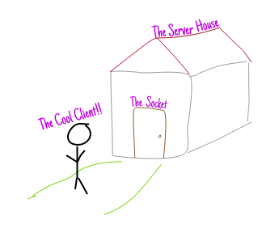

#### What is socket?
- an interface between application process and the transport layer
- one endpoint of 2 way communication between 2 processes
- **IP + port**
- A TCP connection can be uniquely identified by 2 endpoints/ 2 socket

#### File descriptor
- when OS create a socket, it returns an integer called file descriptor that 
represents that socket.
- OS does the same way when it creates a file => socket is like a file in Linux

#### Buffer
- a part of memory (RAM) that hold temporary data
- when writing to a file, if writing directly to disk, it will be very expensive
