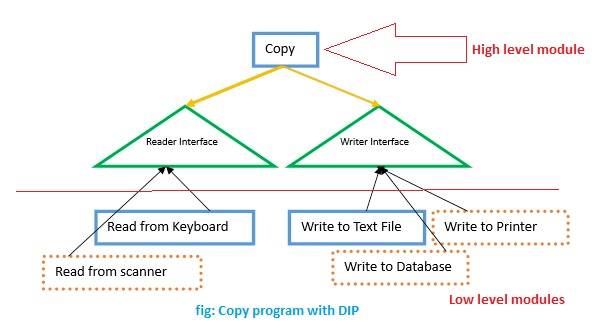

1. Single responsibility principle
2. Open Closed principle
- Classes, functions should be closed for modification but
open for extension
    - closed: each new method should not modify existing source code
    - open: a component should be extendable to make it behave in a new way
- Refactor:
    - Inheritance: extends old class => increase the coupling
    - Strategy pattern: create an interface
    ```Java
        public interface MoneyTransferProc {
            void transferMoney(double amount);
        }
        
        public class BankAccount implements MoneyTransferProc {
            public void transferMoney(double amount) {
            
            }
        }
    ```   
    
3. Liskov substitution principle
- Any object of a type must be substitutable by objects of a subtype 
without altering the correctness of the program.
- Symptom: a class has more functionality than its subclass might not support
- Refactor:
    - eliminate the wrong relations between objects
4. Interface segregation principle
- Client should not be forced to depend on methods that they do not use
- Symptom:
    - interface with many methods
    - interface with low cohesion
    - empty method/ method throws UnsupportedOperationException
     in implementation class

```Java
    public interface Reportable {

        void printPDF();
        void printWord();
        void printExcel();
        void printPPT();
        void printHTML();
    } 
```         

    - refactor:
    - break down "fat" interface
    
5. Dependency inversion principle
- High level modules should not depend on Low level modules;
both should depend on abstractions
- Abstraction should not depend on details;
details should depend upon abstraction:
    - detail changes should not affect abstraction
    - detail must conform to what abstraction says


